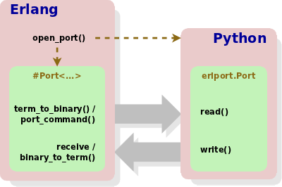

How ErlPort works
-----------------

When ErlPort based Python script is running with the BIF `open_port/2
<http://www.erlang.org/doc/man/erlang.html#open_port-2>`_ the `port
<http://www.erlang.org/doc/tutorial/c_port.html>`_ which communicate with the
external OS process is created.

Now if we want to send an Erlang term to Python we need to encode it to `binary
form <http://www.erlang.org/doc/apps/erts/erl_ext_dist.html>`_ with the BIF
`term_to_binary/1
<http://www.erlang.org/doc/man/erlang.html#term_to_binary-1>`_ and then send
this binary to the port with the BIF `port_command/2
<http://www.erlang.org/doc/man/erlang.html#port_command-2>`_. On the Python
side the binary is read and converted to Python term (see the function
`erlterms.decode()
<https://github.com/hdima/erlport/blob/master/src/erlport/erlterms.py#L85>`_)
with the method `Port.read()
<https://github.com/hdima/erlport/blob/master/src/erlport/erlproto.py#L125>`_.
If ``erlport.Port`` is used with a inheritor class of the `Protocol
<https://github.com/hdima/erlport/blob/master/src/erlport/erlproto.py#L41>`_
then Erlang terms in the form ``'function_name'`` or ``{'function_name', ...}``
will call a method ``aProtocol.handle_function_name`` which must be defined in
the ``Protocol`` inheritor class.

To send a term from Python to Erlang we need to use the method `Port.write()
<https://github.com/hdima/erlport/blob/master/src/erlport/erlproto.py#L132>`_
which convert the term to the binary form with the function `erlterms.encode()
<https://github.com/hdima/erlport/blob/master/src/erlport/erlterms.py#L237>`_
and then send this binary to Erlang. In Erlang the binary can be received from
the port with the `receive
<http://www.erlang.org/doc/reference_manual/expressions.html#id76140>`_
expression (see `port messages
<http://www.erlang.org/doc/reference_manual/ports.html#id83727>`_ for details)
and converted to the term with the BIF `binary_to_term/1
<http://www.erlang.org/doc/man/erlang.html#binary_to_term-1>`_.

Data type mapping
-----------------

Erlang to Python data type mapping as defined by `erlterms.decode()
<https://github.com/hdima/erlport/blob/master/src/erlport/erlterms.py#L85>`_:

=========== ======
Erlang      Python
=========== ======
integer()   int()
list()      list()/String()
binary()    str()
atom()      Atom()
tuple()     tuple()
float()     float()
bitstring() BitBinary()
=========== ======

Python to Erlang data type mapping as defined by `erlterms.encode()
<https://github.com/hdima/erlport/blob/master/src/erlport/erlterms.py#L237>`_:

=================== ======
Python              Erlang
=================== ======
tuple()             tuple()
list()              list()
unicode()           list()
Atom()              atom()
BitBinary()         bitstring()
str()               binary()
True                'true'
False               'false'
int()               integer()
float()             float()
dict()              proplist()
None                'none'
datetime.datetime() calendar:t_datetime()
=================== ======

.. |date| date::
.. container:: date

    Updated on |date|
